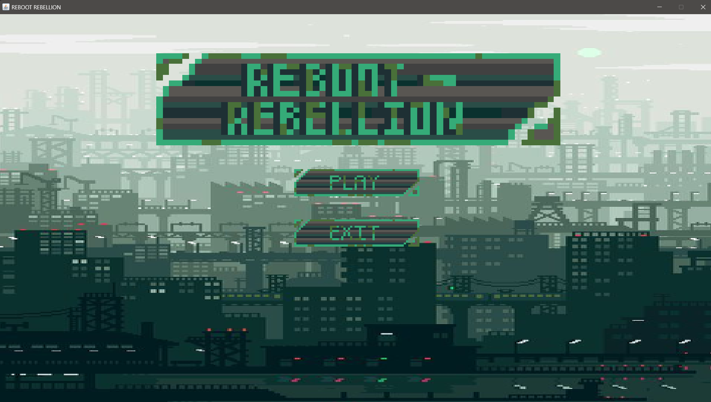
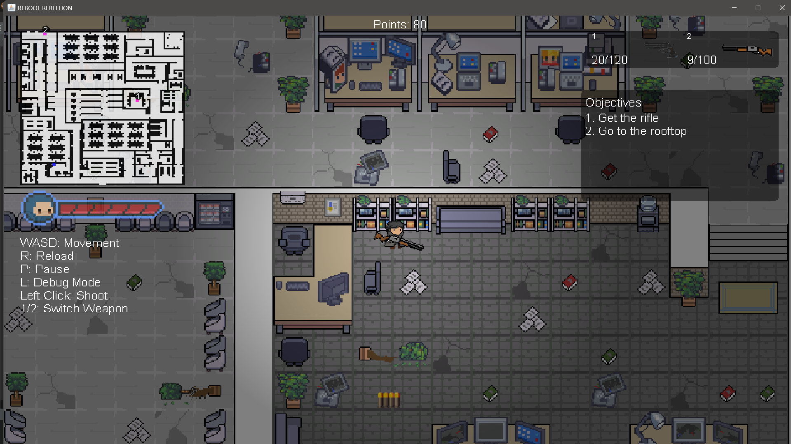
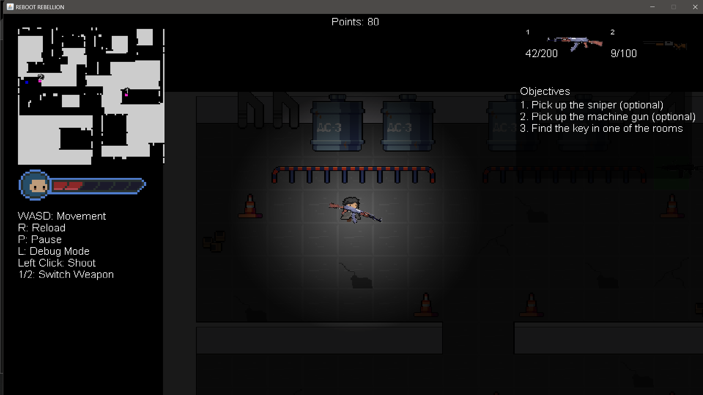
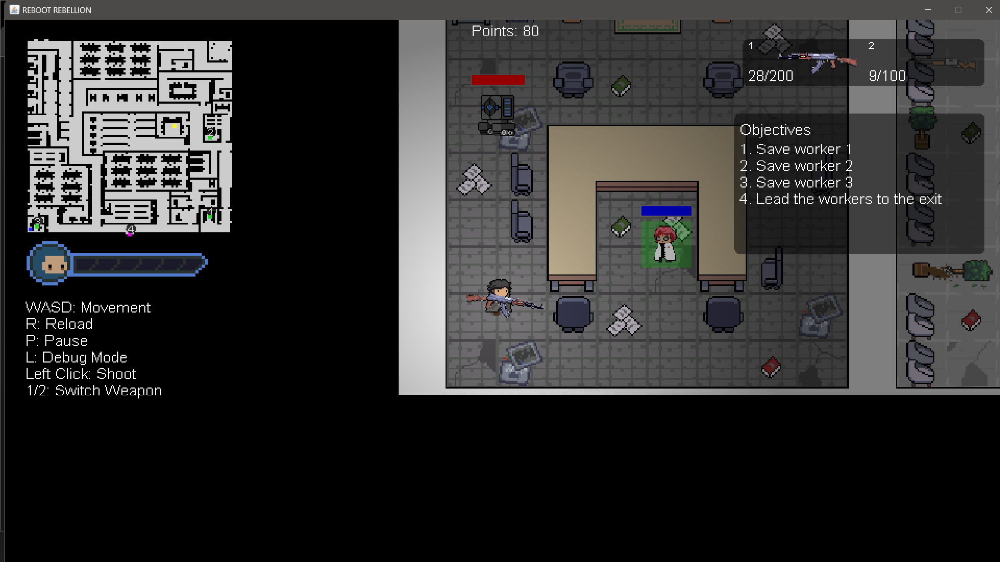
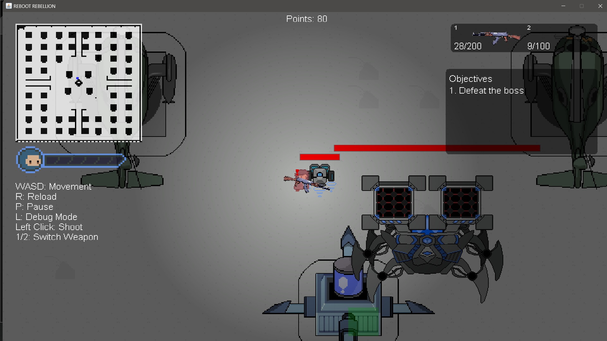
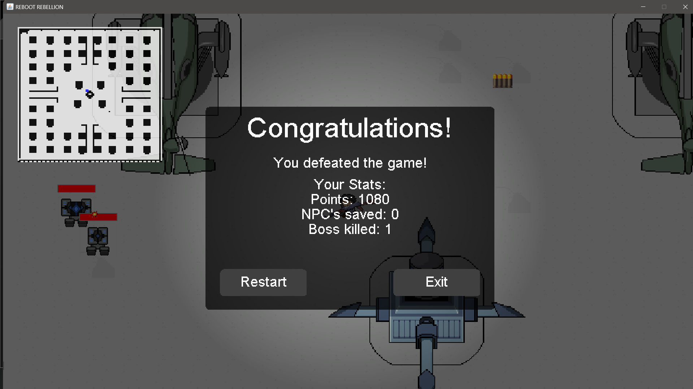

# Reboot Rebellion

Reboot Rebellion includes the development of a 2D top-down action shooter game with multi-level gameplay. The game features dynamic lighting systems which require players to restore power in order to explore dark places, adding an element of strategy to exploration and battles. Rescue missions and a boss battle are included, which adds to the overall immersion and intensity of the game. These aspects strive to provide a unified experience by combining action, strategy, and narrative-driven objectives.

## Screenshots

